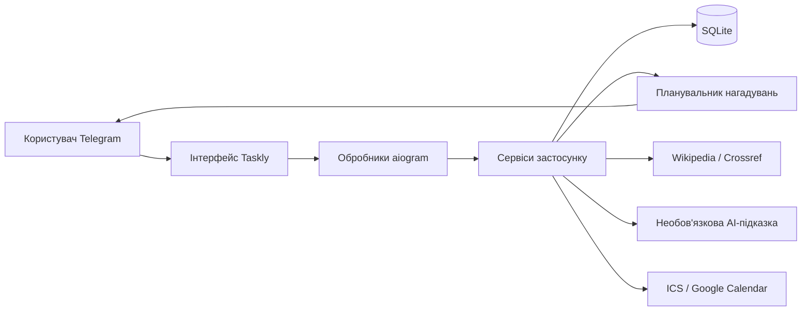

<div align="center">

# ✅ Taskly2

### Твій особистий менеджер в Telegram

**Taskly** — це Telegram-бот для керування особистими завданнями з чистим інтерфейсом, розумними нагадуваннями про дедлайни, пошуком джерел і інтеграцією з календарем.

[](https://www.python.org/)
[](https://docs.aiogram.dev/)
[](https://www.sqlalchemy.org/)
[](https://www.sqlite.org/)
[](#план-розвитку)

</div>

---

## Про проєкт

Taskly2 перетворює звичайний чат у Telegram на компактний простір для планування особистих завдань.

Замість того щоб заповнювати діалог десятками команд і службових повідомлень, бот використовує одне головне повідомлення та оновлює його під час переходу між екранами. Повідомлення користувача після обробки видаляються, тому чат залишається чистим і зрозумілим.

Проєкт створений як навчальний програмний продукт у межах практики зі спеціальності «Інженерія програмного забезпечення». Він демонструє роботу з асинхронним програмуванням, Telegram Bot API, кінцевими автоматами, реляційною базою даних, фоновими завданнями та зовнішніми API.

## Чому Taskly?

Більшість простих Telegram-ботів для завдань працюють як набір команд: кожна дія створює нове повідомлення, через що чат швидко стає незручним.

Taskly2 побудований навколо чотирьох основних ідей:

- **Чистий чат** — одне головне повідомлення редагується замість створення нових.
- **Контроль дедлайнів** — користувач отримує кілька нагадувань до настання терміну виконання.
- **Допомога з контекстом** — для навчальних і дослідницьких завдань бот може підібрати реальні джерела.
- **Інтеграція з календарем** — завдання можна експортувати до календаря пристрою або Google Calendar.

## Можливості

### Керування завданнями

- створення завдання через покроковий діалог;
- додавання назви, опису, дедлайну та пріоритету;
- перегляд усіх активних завдань;
- перегляд завдань на сьогодні;
- редагування даних завдання;
- позначення завдання як виконаного;
- видалення з підтвердженням;
- перегляд статистики продуктивності.

### Режим чистого чату

- Inline-навігація замість постійної Reply-клавіатури;
- одне головне повідомлення Taskly2;
- автоматичне видалення оброблених повідомлень користувача;
- автоматичне прибирання випадкових текстових повідомлень;
- окремі повідомлення лише для важливих нагадувань.

### Розумні нагадування

Для кожного завдання можна обрати один із режимів:

- за один день, за одну годину та в момент дедлайну;
- за одну годину та в момент дедлайну;
- лише в момент дедлайну;
- без нагадувань.

У повідомленні-нагадуванні доступні кнопки:

- **«Виконано»**;
- **«Побачив»**;
- **«Відкрити завдання»**.

### Пошук джерел

Для завдань на кшталт написання статті, реферату, есе, доповіді або презентації Taskly2 може знайти релевантні матеріали через:

- українську Wikipedia;
- Crossref.

За наявності OpenAI API ключа бот також може сформувати коротку AI-підказку на основі вже знайдених джерел.

AI не створює посилання самостійно — він лише допомагає структурувати подальші кроки.

### Інтеграція з календарем

Taskly2 підтримує два способи додавання завдання до календаря:

- створення `.ics`-файлу для Apple Calendar, Google Calendar, Outlook та інших календарів;
- відкриття готової форми події в Google Calendar.

Подія завершується в момент дедлайну та починається за вказану кількість хвилин до нього.

## Схема роботи



## Технології

| Рівень | Технологія |
|---|---|
| Мова програмування | Python 3.9+ |
| Telegram-фреймворк | aiogram 3 |
| ORM | SQLAlchemy 2 |
| База даних | SQLite |
| Планувальник | APScheduler |
| HTTP-клієнт | aiohttp |
| Конфігурація | python-dotenv |
| Пошук джерел | Wikipedia API, Crossref REST API |
| Необов’язковий AI | OpenAI Responses API |
| Експорт календаря | iCalendar (`.ics`) |

## Структура проєкту

```text
taskly-telegram-bot/
├── bot.py
├── config.py
├── database.py
├── scheduler.py
│
├── handlers/
│   ├── start.py
│   ├── tasks.py
│   ├── statistics.py
│   ├── reminders.py
│   ├── integrations.py
│   └── fallback.py
│
├── keyboards/
│   ├── main_menu.py
│   └── task_keyboard.py
│
├── models/
│   ├── user.py
│   ├── task.py
│   └── reminder.py
│
├── services/
│   ├── user_service.py
│   ├── task_service.py
│   ├── reminder_service.py
│   ├── ui_service.py
│   ├── time_service.py
│   ├── source_service.py
│   └── calendar_service.py
│
├── utils/
│   └── helpers.py
│
├── requirements.txt
├── .env.example
├── .gitignore
└── README.md
```

## Архітектура

Taskly2 використовує просту багаторівневу архітектуру:

- **Handlers** — приймають події Telegram і керують сценаріями взаємодії.
- **Keyboards** — формують кнопки навігації та дій.
- **Services** — містять бізнес-логіку й інтеграції із зовнішніми сервісами.
- **Models** — описують сутності бази даних.
- **Scheduler** — перевіряє та надсилає нагадування.
- **Utils** — містять функції форматування та перевірки даних.

Такий підхід відокремлює Telegram-логіку від роботи з даними та дозволяє легко розширювати проєкт.

## Швидкий запуск

### 1. Клонування репозиторію

```bash
git clone <ПОСИЛАННЯ_НА_ВАШ_РЕПОЗИТОРІЙ>
cd taskly-telegram-bot
```

### 2. Створення віртуального середовища

macOS або Linux:

```bash
python3 -m venv .venv
source .venv/bin/activate
```

Windows:

```powershell
python -m venv .venv
.venv\Scripts\activate
```

### 3. Встановлення залежностей

```bash
pip install -r requirements.txt
```

### 4. Створення файлу конфігурації

Скопіюйте приклад:

```bash
cp .env.example .env
```

У Windows створіть копію `.env.example` та перейменуйте її на `.env`.

### 5. Додавання Telegram-токена

Створіть бота через офіційного бота Telegram `@BotFather`, після чого вставте токен у `.env`:

```env
BOT_TOKEN=ВАШ_TELEGRAM_BOT_TOKEN
```

### 6. Запуск

```bash
python bot.py
```

Після запуску відкрийте бота в Telegram і надішліть:

```text
/start
```

База даних SQLite та всі необхідні таблиці створяться автоматично.

## Налаштування

| Змінна | Обов’язкова | Значення за замовчуванням | Призначення |
|---|---:|---|---|
| `BOT_TOKEN` | Так | — | Telegram-токен бота |
| `DATABASE_URL` | Ні | `sqlite:///tasks.db` | Адреса бази даних SQLAlchemy |
| `TIMEZONE` | Ні | `Europe/Kyiv` | Часовий пояс дедлайнів |
| `REMINDER_CHECK_SECONDS` | Ні | `30` | Інтервал перевірки нагадувань |
| `DEFAULT_REMINDER_OFFSETS` | Ні | `1440,60,0` | Відступи нагадувань у хвилинах |
| `CALENDAR_EVENT_MINUTES` | Ні | `30` | Тривалість події перед дедлайном |
| `SOURCE_SEARCH_TIMEOUT` | Ні | `15` | Тайм-аут зовнішніх API |
| `CROSSREF_MAILTO` | Ні | порожньо | Контактна адреса для Crossref |
| `OPENAI_API_KEY` | Ні | порожньо | Вмикає AI-підказки |
| `OPENAI_MODEL` | Для AI | порожньо | ID моделі, доступної у вашому API-проєкті |

Приклад `.env`:

```env
BOT_TOKEN=ВАШ_TELEGRAM_BOT_TOKEN
DATABASE_URL=sqlite:///tasks.db
TIMEZONE=Europe/Kyiv

REMINDER_CHECK_SECONDS=30
DEFAULT_REMINDER_OFFSETS=1440,60,0

CALENDAR_EVENT_MINUTES=30

SOURCE_SEARCH_TIMEOUT=15
CROSSREF_MAILTO=developer@example.com

OPENAI_API_KEY=
OPENAI_MODEL=
```

## Створення завдання

Користувач проходить простий покроковий сценарій:

```text
Створити завдання
        ↓
Ввести назву
        ↓
Ввести опис або пропустити
        ↓
Ввести дедлайн
        ↓
Обрати пріоритет
        ↓
Завдання збережено
```

Taskly2 перевіряє правильність назви та дедлайну перед збереженням.

## Логіка нагадувань

Конфігурація за замовчуванням:

```env
DEFAULT_REMINDER_OFFSETS=1440,60,0
```

означає:

- `1440` — за один день;
- `60` — за одну годину;
- `0` — у момент дедлайну.

Якщо час певного нагадування вже минув, воно автоматично пропускається.

Після зміни дедлайну всі майбутні нагадування створюються заново.

## Пошук джерел та AI

Пошук джерел працює навіть без OpenAI API ключа.

Схема роботи:

```text
Назва та опис завдання
          ↓
Пошук у Wikipedia та Crossref
          ↓
Реальні назви й посилання
          ↓
Необов’язкова AI-підказка
```

Щоб увімкнути AI-підказки:

```env
OPENAI_API_KEY=ВАШ_СЕКРЕТНИЙ_API_КЛЮЧ
OPENAI_MODEL=ID_ДОСТУПНОЇ_МОДЕЛІ
```

Не додавайте справжні ключі безпосередньо в Python-файли та не завантажуйте `.env` на GitHub.

## Робота з календарем

Файл `.ics` містить:

- назву завдання;
- опис;
- часовий пояс;
- час початку та завершення;
- нагадування календаря.

Кнопка Google Calendar відкриває форму створення події з уже заповненими даними.

Telegram-бот не може непомітно додати подію до локального календаря без підтвердження користувача.

## База даних та міграції

За замовчуванням Taskly2 використовує SQLite.

Застосунок автоматично створює відсутні таблиці та містить прості міграції для полів, які були додані під час розробки.

Завдяки цьому попередній файл `tasks.db` можна використовувати й у новішій версії проєкту.

Для масштабнішого застосунку надалі можна перейти на PostgreSQL і Alembic.

## Безпека

- `.env` виключений через `.gitignore`;
- API-ключі зчитуються зі змінних середовища;
- операції із завданнями перевіряють Telegram ID користувача;
- кожна callback-дія пов’язана з конкретним завданням;
- OpenAI-інтеграція є необов’язковою;
- посилання на джерела отримуються із зовнішніх сервісів, а не генеруються мовною моделлю.

Перед завантаженням на GitHub перевірте:

```bash
git status
```

Переконайтеся, що `.env`, `tasks.db` і `.venv/` не потрапили до коміту.

## Перевірка під час розробки

Перевірка синтаксису всіх Python-файлів:

```bash
python -m compileall .
```

Локальний запуск:

```bash
python bot.py
```

Рекомендовані ручні перевірки:

- `/start` створює або оновлює головне повідомлення;
- повідомлення користувача видаляються після обробки;
- нове завдання зберігається в базі;
- минула дата не приймається як дедлайн;
- режими нагадувань правильно змінюються;
- завершення завдання скасовує майбутні нагадування;
- `.ics`-файл відкривається календарем;
- пошук джерел повертає реальні посилання.

## План розвитку

- [x] Чистий інтерфейс у Telegram
- [x] CRUD-операції із завданнями
- [x] Кілька режимів нагадувань
- [x] Статистика продуктивності
- [x] Пошук джерел
- [x] Необов’язкові AI-підказки
- [x] Експорт до календаря
- [ ] Повторювані завдання
- [ ] Вибір часового поясу користувачем
- [ ] Категорії та теги
- [ ] Профіль розгортання з PostgreSQL
- [ ] Docker-конфігурація
- [ ] Автоматизовані тести
- [ ] Вебпанель адміністратора

## Участь у розробці

Пропозиції щодо покращення та нові ідеї вітаються.

1. Зробіть Fork репозиторію.
2. Створіть нову гілку:

```bash
git checkout -b feature/my-feature
```

3. Збережіть зміни:

```bash
git commit -m "Add my feature"
```

4. Завантажте гілку:

```bash
git push origin feature/my-feature
```

5. Створіть Pull Request.

Нові функції бажано реалізовувати відповідно до поточної архітектури та концепції чистого чату.

## Відомі обмеження

- SQLite підходить для невеликого локального або навчального розгортання.
- FSM-стани зберігаються в оперативній пам’яті та скидаються після перезапуску.
- Якість результатів пошуку залежить від Wikipedia та Crossref.
- AI-підказки потребують окремого API-доступу та можуть бути платними.
- Google Calendar відкриває форму підтвердження замість автоматичного запису.
- Telegram може обмежувати видалення або редагування старих повідомлень.

## Навчальна цінність

Проєкт демонструє такі аспекти інженерії програмного забезпечення:

- аналіз вимог;
- модульну архітектуру;
- асинхронне програмування;
- кінцеві автомати;
- ORM і реляційне моделювання;
- зв’язки «один до багатьох»;
- фонове планування;
- інтеграцію із зовнішніми API;
- обробку помилок;
- керування конфігурацією;
- базові міграції даних;
- безпечне зберігання секретів;
- проєктування інтерфейсу всередині Telegram.

## Використані технології та сервіси

Taskly2 створений із використанням:

- aiogram;
- SQLAlchemy;
- APScheduler;
- aiohttp;
- Wikipedia API;
- Crossref REST API;
- необов’язкової інтеграції з OpenAI API.

## Ліцензія

Проєкт створений як навчальна робота.

Перед відкритим поширенням рекомендується додати окремий файл `LICENSE` і вказати обрану ліцензію в цьому розділі.

---

<div align="center">

**Taskly2 — Твій особистий менеджер в Telegram.**

</div>
# Testly2
