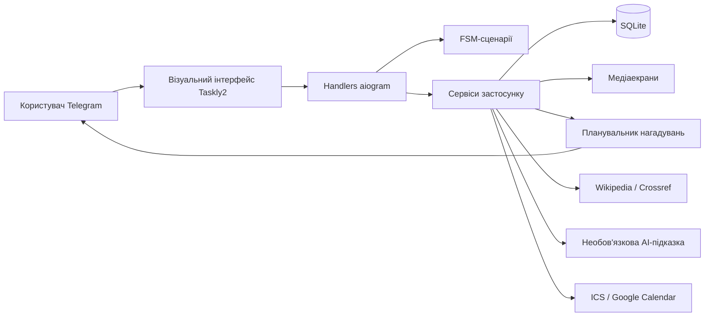

# ✅ Taskly2

<p align="center">
  
</p>

<p align="center">
  <strong>Твій особистий менеджер завдань у Telegram</strong>
</p>

<p align="center">
  
  
  
  
</p>

---

## Про проєкт

**Taskly2** — Telegram-бот для створення, планування та контролю особистих завдань.

Бот використовує концепцію **чистого чату**: замість великої кількості службових повідомлень він показує один актуальний екран із зображенням, текстом та inline-кнопками. Повідомлення користувача після обробки видаляються.

Проєкт створений як навчальна робота зі спеціальності **«Інженерія програмного забезпечення»**.

---

## Основні можливості

- покрокове створення завдання;
- назва, опис, дедлайн і пріоритет;
- перегляд усіх активних завдань;
- окремий список завдань на сьогодні;
- редагування та видалення завдань;
- позначення завдання як виконаного;
- статистика продуктивності;
- автоматичні нагадування;
- пошук джерел через Wikipedia та Crossref;
- необов’язкова AI-підказка;
- експорт до календаря;
- візуальні медіаекрани для основних розділів.

---

## Інтерфейс

### Створення завдання

Користувач проходить чотири етапи:

1. введення назви;
2. введення опису;
3. введення дедлайну;
4. вибір пріоритету.

Після збереження фінальний екран використовує зображення четвертого етапу.

<table>
  <tr>
    <td align="center">
      <br>
      <strong>1. Назва</strong>
    </td>
    <td align="center">
      <br>
      <strong>2. Опис</strong>
    </td>
  </tr>
  <tr>
    <td align="center">
      <br>
      <strong>3. Дедлайн</strong>
    </td>
    <td align="center">
      <br>
      <strong>4. Пріоритет і результат</strong>
    </td>
  </tr>
</table>

### Основні розділи

<table>
  <tr>
    <td align="center">
      <br>
      <strong>Мої завдання / На сьогодні</strong>
    </td>
    <td align="center">
      <br>
      <strong>Статистика</strong>
    </td>
  </tr>
  <tr>
    <td align="center">
      <br>
      <strong>Налаштування</strong>
    </td>
    <td align="center">
      <br>
      <strong>Допомога</strong>
    </td>
  </tr>
</table>

> Зображення з’являться в README після додавання відповідних файлів до Git та завантаження на GitHub.

---

## Схема роботи



---

## Технології

| Рівень | Технологія |
|---|---|
| Мова програмування | Python 3.11+ |
| Telegram-фреймворк | aiogram 3.13.1 |
| ORM | SQLAlchemy 2 |
| База даних | SQLite |
| FSM | aiogram FSM / MemoryStorage |
| Планувальник | APScheduler |
| HTTP-клієнт | aiohttp |
| Конфігурація | python-dotenv |
| Пошук джерел | Wikipedia API, Crossref REST API |
| AI | OpenAI API, необов’язково |
| Календар | iCalendar `.ics`, Google Calendar |

---

## Структура проєкту

```text
Testly2/
├── assets/
│   ├── start.png
│   ├── create/
│   │   ├── step_1.png
│   │   ├── step_2.png
│   │   ├── step_3.png
│   │   └── step_4.png
│   ├── tasks/
│   │   └── tasks.png
│   ├── statistics/
│   │   └── statistics.png
│   ├── settings/
│   │   └── settings.png
│   └── help/
│       └── help.png
├── handlers/
├── keyboards/
├── models/
├── services/
│   ├── screen_images.py
│   └── ui_service.py
├── utils/
├── bot.py
├── config.py
├── database.py
├── scheduler.py
├── requirements.txt
├── .env.example
├── .gitignore
└── README.md
```

---

## Швидкий запуск

### 1. Клонування

```bash
git clone https://github.com/JeanShain/Testly2.git
cd Testly2
```

### 2. Віртуальне середовище

macOS або Linux:

```bash
python3 -m venv .venv
source .venv/bin/activate
```

Windows:

```powershell
python -m venv .venv
.venv\Scripts\activate
```

### 3. Залежності

```bash
pip install -r requirements.txt
```

### 4. Налаштування

```bash
cp .env.example .env
```

Мінімальний `.env`:

```env
BOT_TOKEN=ВАШ_TELEGRAM_BOT_TOKEN
DATABASE_URL=sqlite:///tasks.db
TIMEZONE=Europe/Kyiv
```

Необов’язкові параметри:

```env
REMINDER_CHECK_SECONDS=30
DEFAULT_REMINDER_OFFSETS=1440,60,0
CALENDAR_EVENT_MINUTES=30
SOURCE_SEARCH_TIMEOUT=15
CROSSREF_MAILTO=
OPENAI_API_KEY=
OPENAI_MODEL=
```

### 5. Запуск

```bash
python bot.py
```

Після запуску надішліть боту:

```text
/start
```

---

## Як працюють зображення

Шляхи до медіафайлів зручно зберігати у:

```text
services/screen_images.py
```

Приклад:

```python
from pathlib import Path

PROJECT_DIR = Path(__file__).resolve().parent.parent
ASSETS_DIR = PROJECT_DIR / "assets"

CREATE_STEP_1_IMAGE = ASSETS_DIR / "create" / "step_1.png"
CREATE_STEP_2_IMAGE = ASSETS_DIR / "create" / "step_2.png"
CREATE_STEP_3_IMAGE = ASSETS_DIR / "create" / "step_3.png"
CREATE_STEP_4_IMAGE = ASSETS_DIR / "create" / "step_4.png"

TASKS_IMAGE = ASSETS_DIR / "tasks" / "tasks.png"
STATISTICS_IMAGE = ASSETS_DIR / "statistics" / "statistics.png"
SETTINGS_IMAGE = ASSETS_DIR / "settings" / "settings.png"
HELP_IMAGE = ASSETS_DIR / "help" / "help.png"
```

Зображення в README додається так:

```markdown

```

Для керування розміром:

```html

```

---

## Створення завдання

```text
Створити завдання
        ↓
1. Ввести назву
        ↓
2. Ввести опис або пропустити
        ↓
3. Ввести дедлайн
        ↓
4. Обрати пріоритет
        ↓
Завдання збережено
```

Taskly2 перевіряє:

- довжину назви;
- довжину опису;
- формат дати;
- чи знаходиться дедлайн у майбутньому;
- коректність пріоритету.

---

## Нагадування

```env
DEFAULT_REMINDER_OFFSETS=1440,60,0
```

- `1440` — за один день;
- `60` — за одну годину;
- `0` — у момент дедлайну.

---

## Безпека

- секрети зберігаються у `.env`;
- `.env` не повинен потрапляти до Git;
- операції із завданнями перевіряють Telegram ID користувача;
- OpenAI-інтеграція є необов’язковою;
- токени й API-ключі не додаються до Python-файлів.

---

## Перевірка

```bash
python -m compileall .
python bot.py
```

Перевірте:

- `/start` відкриває головний медіаекран;
- кожен етап створення показує правильне зображення;
- фінал використовує зображення четвертого етапу;
- списки завдань відкриваються;
- статистика, налаштування й допомога показують свої зображення;
- нове завдання зберігається в базі;
- нагадування працюють відповідно до конфігурації.

---

## Завантаження змін на GitHub

```bash
git add README.md assets services handlers
git commit -m "Update README and add visual interface"
git push
```

---

## Відомі обмеження

- SQLite призначена для локального або невеликого навчального розгортання;
- FSM-стани в `MemoryStorage` скидаються після перезапуску;
- підпис до фотографії Telegram має обмеження за довжиною;
- AI-функції потребують окремого API-доступу;
- зовнішні сервіси можуть бути тимчасово недоступними.

---

## План розвитку

- повторювані завдання;
- категорії та теги;
- персональний вибір часового поясу;
- PostgreSQL і Alembic;
- Docker;
- автоматизовані тести;
- вебпанель адміністратора;
- кешування Telegram `file_id`.

---

<p align="center">
  <strong>Taskly2 — плануй день, контролюй дедлайни та зберігай чат чистим.</strong>
</p>
